# Resourced.local Domain Compromise

## 1. Overview

This assessment simulated an internal threat actor compromising a Windows Active Directory environment through credential abuse and privilege escalation via misconfigured Active Directory permissions. The attacker escalated privileges from a domain user to full control over the Domain Controller.

---

## 2. Initial Enumeration

### 🔍 Nmap Scan

Performed a port scan to identify exposed services on the target.

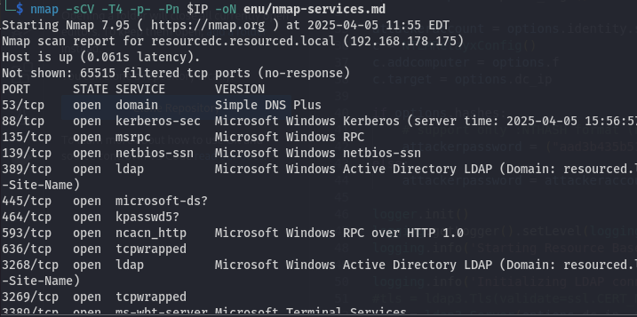

Notable Identified services:
- SMB
- RPC
- LDAP
- WinRM

---

## 3. SMB Enumeration

Tested anonymous SMB login — no shares were available.

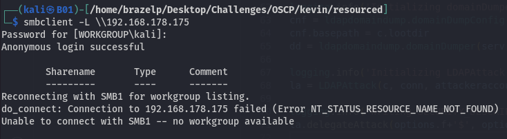

Used `rpcclient` to enumerate user RIDs and descriptions.

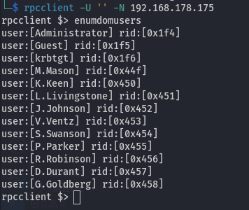

Discovered user account `V.Ventz` with a description that hinted at a password.

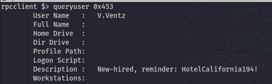

---

## 4. Gaining Initial Access

Checked this password with crackmapexec and found some readable shares:

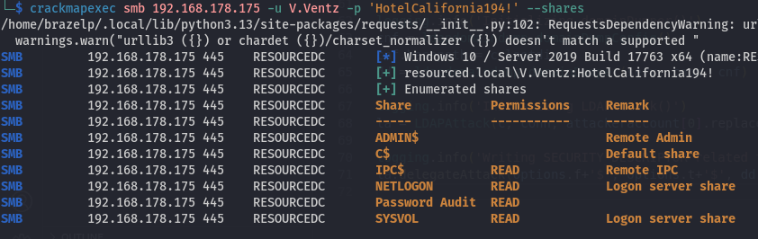

Enumerated available shares and identified sensitive files on the "Password Audit" share.

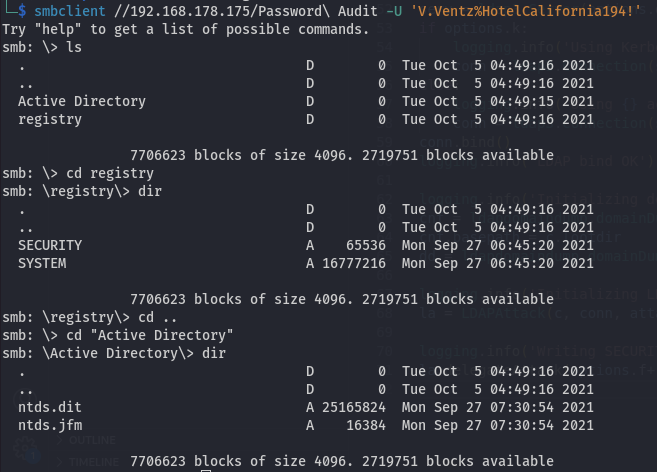

---

## 5. Dumping Credentials

Downloaded `ntds.dit` and `SYSTEM` files from the share and extracted all domain user hashes.

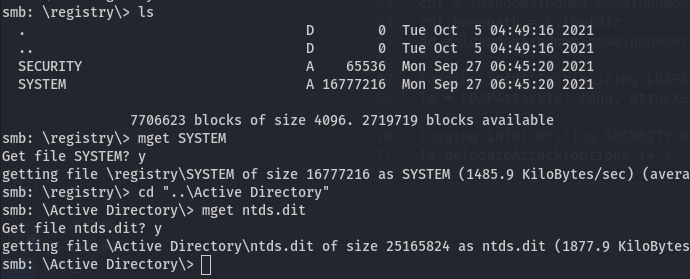
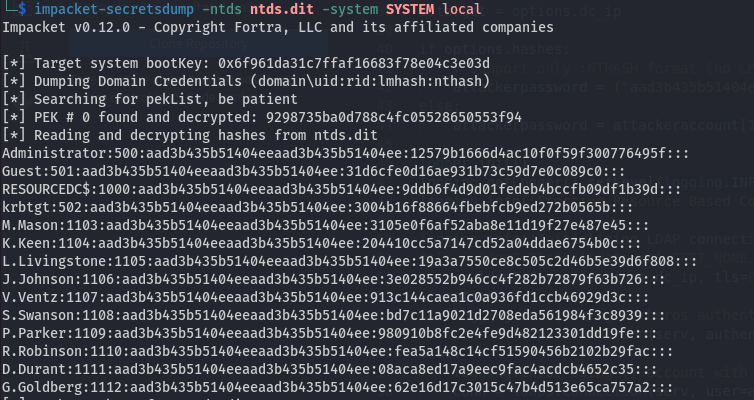

Extracted accounts included `Administrator`, `L.Livingstone`, and others.  
Tested pass-the-hash and found a valid one:

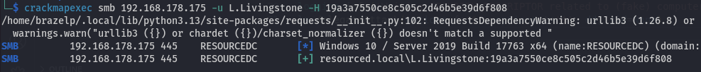

---

## 6. Remote Access via Evil-WinRM

Logged into the target using the `L.Livingstone` NTLM hash via WinRM.

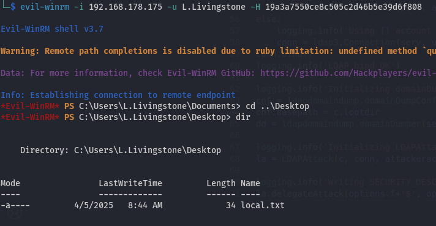

⚠️ Evil-WinRM was very slow and unresponsive, so I opted for offline enumeration.

---

## 7. Offline AD Enumeration via BloodHound

Used `bloodhound-python` with the NTLM hash to collect AD data externally.

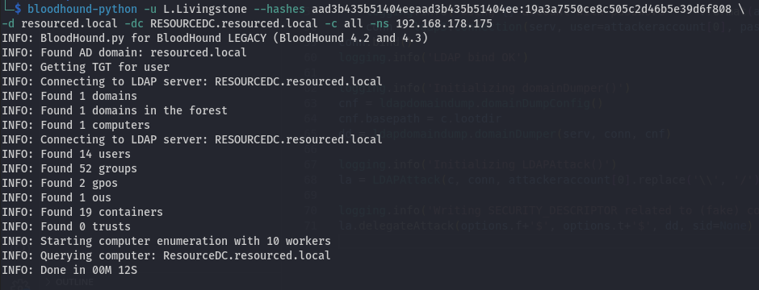

Loaded data into BloodHound and identified a misconfiguration:

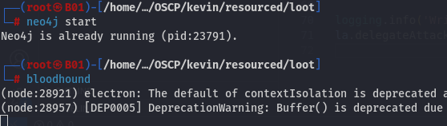
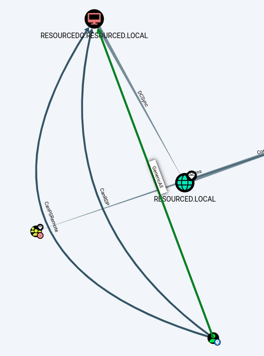

`L.Livingstone` had `GenericAll` on the Domain Controller object.

---

## 8. Privilege Escalation via RBCD

### 8.1 Create a Machine Account

Used current access to create a new computer account in the domain.

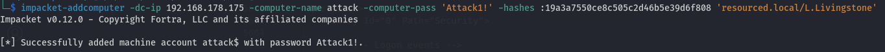

### 8.2 Delegate to the DC

Used `rbcd.py` to set delegation rights on the DC.

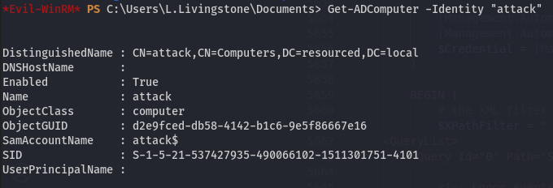

---

## 9. Domain Admin via Ticket Forging

### 9.1 Get Administrator TGT

Used Impacket’s `getST` to forge a TGT for the Administrator user.

### 9.2 Use the Ticket

Used the forged TGT with `psexec.py` to gain SYSTEM shell access to the DC.

🎉 Full compromise of the `resourced.local` domain achieved.

---

## 10. Lessons Learned

- User descriptions can leak sensitive credentials.
- Readable shares exposing `ntds.dit` and `SYSTEM` provide full credential dumps.
- `GenericAll` on a DC object enables full domain compromise via RBCD.
- Offline BloodHound recon is powerful when shells are unstable.
